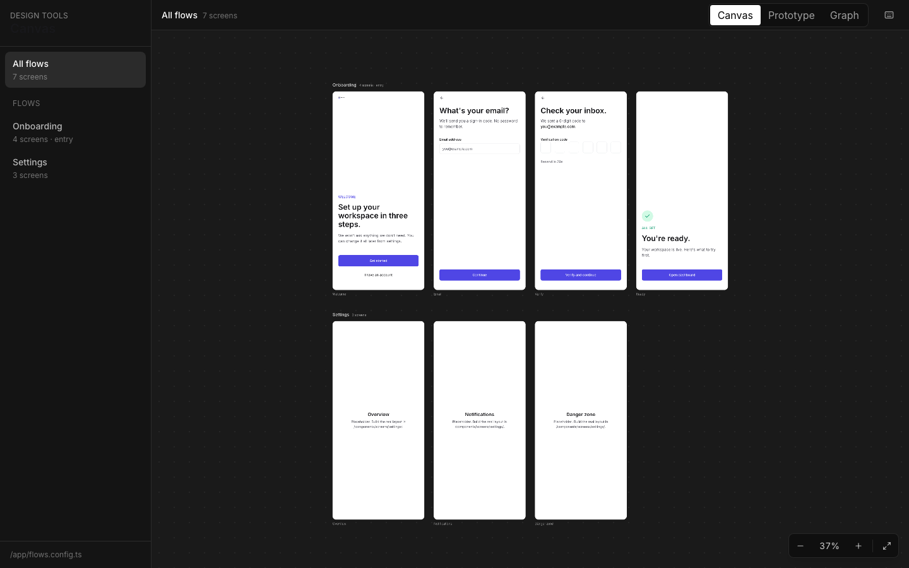
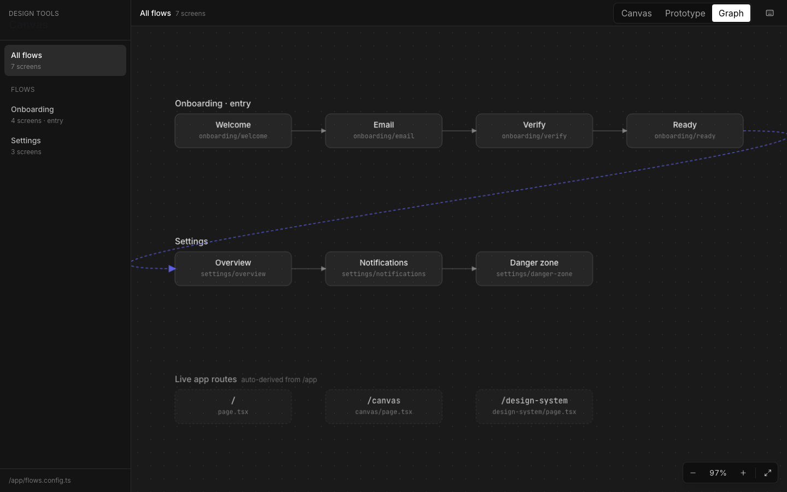
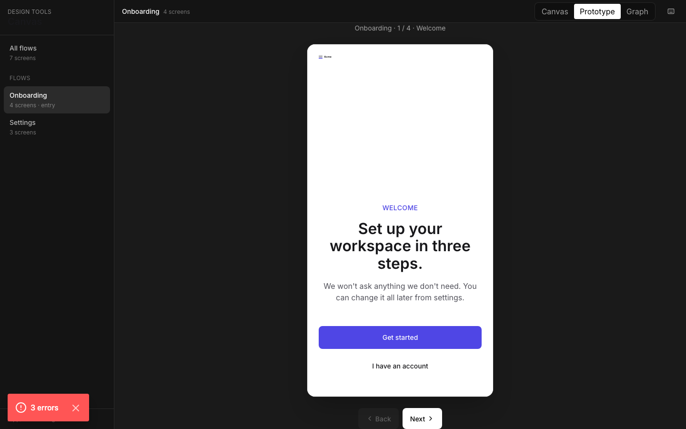

# AI Design Playbook Starter

A Next.js + shadcn/ui + Tailwind starter that follows the [AI Design Playbook](https://ai-design-playbook.vercel.app) — codebase as design system, designers ship via PRs, no Figma-to-code translation layer.

> **Phase 1 setup, ready to clone.** Replace placeholder brand identity, run the contrast audit, build your first flow.



A Figma-style canvas, a click-through prototype, and a graph view auto-derived from `flows.config.ts` plus your live `/app/` routes. All three views share zoom, pan, and a fixed flow nav.

| Canvas | Graph | Prototype |
|---|---|---|
|  |  |  |

## What you get

- **`tokens.css`** — three-layer token system (primitive → semantic → component) with dark mode and reduced-motion baked in
- **`/skills/*.md`** — six persistent context files Claude Code reads before relevant tasks: `brand.md`, `a11y.md`, `copy.md`, `performance.md`, `components.md`, `decisions.md`
- **`CLAUDE.md`** — auto-loaded at every Claude Code session; codifies the 8 absolute rules and your taste preferences
- **shadcn/ui** integration via `components.json` — `npx shadcn add` works out of the box; primitives are themed through tokens, never structurally modified
- **`/design-system`** — living style guide auto-reflecting current tokens
- **`/canvas`** — Figma-style design tool with three modes: zoomable canvas, click-through prototype, and an auto-derived graph view. Design-only, 404s in production. Shareable via `/canvas?view=graph&flow=onboarding`.
- **`/components/screens/onboarding/`** — a real example flow (welcome / email with form validation / 6-digit verify with resend timer / ready) you can read, copy, and replace
- **`/decisions/log.json` + `CHANGELOG.md`** — structured decision records, weekly auto-changelog
- **`/locales/en.json`** — content tokens; UI never hardcodes strings
- **`/tokens/design-tokens.json`** — W3C DTCG export
- **`npm run tokens:audit`** — WCAG 2.1 contrast audit script that runs against `tokens.css` and exits non-zero on AA failure
- **`npm run check`** — typecheck + lint + tokens:audit + build, also wired as a GitHub Actions workflow on every PR
- **Theme toggle** with no-flash inline script, automatic system-preference detection

## Quick start

```bash
git clone https://github.com/kyle-c/ai-design-playbook-starter.git
cd ai-design-playbook-starter
npm install
npm run dev
```

Open:
- [http://localhost:3000](http://localhost:3000) — landing
- [http://localhost:3000/design-system](http://localhost:3000/design-system) — living style guide
- [http://localhost:3000/canvas](http://localhost:3000/canvas) — Figma-style design tool (canvas / prototype / graph)

Inside `/canvas`, press `?` to see all keyboard shortcuts.

## Make it yours

1. **Replace placeholder brand identity** in `/skills/brand.md` (logo, type, color, motion principles).
2. **Update primitives** in `/styles/tokens.css` — change hex values; semantic tokens stay the same.
3. **Run the contrast audit:**
   ```bash
   npm run tokens:audit
   ```
   Fix any AA failures at the primitive layer before building screens.
4. **Update `CLAUDE.md`** — your taste preferences, project status, and skill loading rules persist across Claude sessions. This is the file that does the most work.
5. **Build your first flow** — pick one critical user journey, list every screen (happy path + empty + error + loading), and ask Claude to generate them in one pass. Real copy from `copy.md`, real tokens from `tokens.css`.

## Adding shadcn components

The project is configured for `npx shadcn`:

```bash
npx shadcn@latest add dialog
npx shadcn@latest add dropdown-menu
```

New components write to `/components/ui/` and inherit the token theming. **Never modify their structure** — compose them in `/components/placeholder/` instead.

## The 8 absolute rules (enforced)

1. Never hardcode color or spacing values; CSS variables only.
2. Never install packages without explaining why no existing one fits.
3. Never modify `/components/ui/*` structure; theme through tokens.
4. Never push directly to `main`.
5. Never ship `/canvas` or `/prototype` to production.
6. Never accept placeholder copy.
7. Always add `prefers-reduced-motion` to animations >100ms.
8. All touch targets ≥ 44×44px on mobile.

Full text in [CLAUDE.md](./CLAUDE.md).

## Folder map

```
/app                              Next.js routes
  /design-system                  Living style guide (token reference + components)
  /canvas                         Design tool: canvas / prototype / graph
  flows.config.ts                 Flow → screen registry
/components
  /ui                             shadcn primitives (themed via tokens, shadcn alias names)
  /screens/[flow]                 Whole screens (semantic intent names)
  /composites                     Composites — created on the third repetition
/styles/tokens.css                THE source of truth
/skills/*.md                      Persistent context for Claude
/decisions                        Structured decision log + changelog
/tokens/design-tokens.json        W3C DTCG export
/locales/en.json                  Content tokens
/lib/scan-routes.ts               Walks /app/ for the graph view's "Live app routes" track
/scripts/audit-tokens.mjs         WCAG contrast audit
/.github/workflows/check.yml      CI: typecheck, lint, tokens:audit, build
```

## Working with Claude Code

This starter is built for [Claude Code](https://claude.com/claude-code). When you open the project, `CLAUDE.md` is auto-loaded with the rules, folder map, and instructions to read the right skill files for each task.

Useful prompts:
- *"Read `/skills/brand.md` and `/styles/tokens.css`. Build a sign-up flow with welcome, email entry, verification, and ready states. Follow `/skills/copy.md` for all strings."*
- *"Audit `/app` and `/components` for hardcoded colors or spacing. Replace with token references."*
- *"Run `npm run tokens:audit`. Fix any failing pairs at the primitive layer in `tokens.css`."*

## Deploy

This starter deploys cleanly to Vercel:

[](https://vercel.com/new/clone?repository-url=https://github.com/kyle-c/ai-design-playbook-starter)

In production, `/canvas` and `/prototype` 404 automatically — they're design-only routes.

## Philosophy

> *"Design in code. Working screens from day one. Codebase is the single source of truth. Designers ship PRs, not handoffs."*
> — [AI Design Playbook](https://ai-design-playbook.vercel.app)

The bet: eliminating the Figma-to-code translation layer eliminates most of the friction. If the designer can write code (or have AI write it for them) and engineers review that code, the feedback loop tightens dramatically.

## License

MIT — see [LICENSE](./LICENSE).

## Credits

- Built on the [AI Design Playbook](https://ai-design-playbook.vercel.app) by its authors.
- Component primitives based on [shadcn/ui](https://ui.shadcn.com).
- Token format follows [W3C DTCG](https://design-tokens.github.io/community-group/format/).
